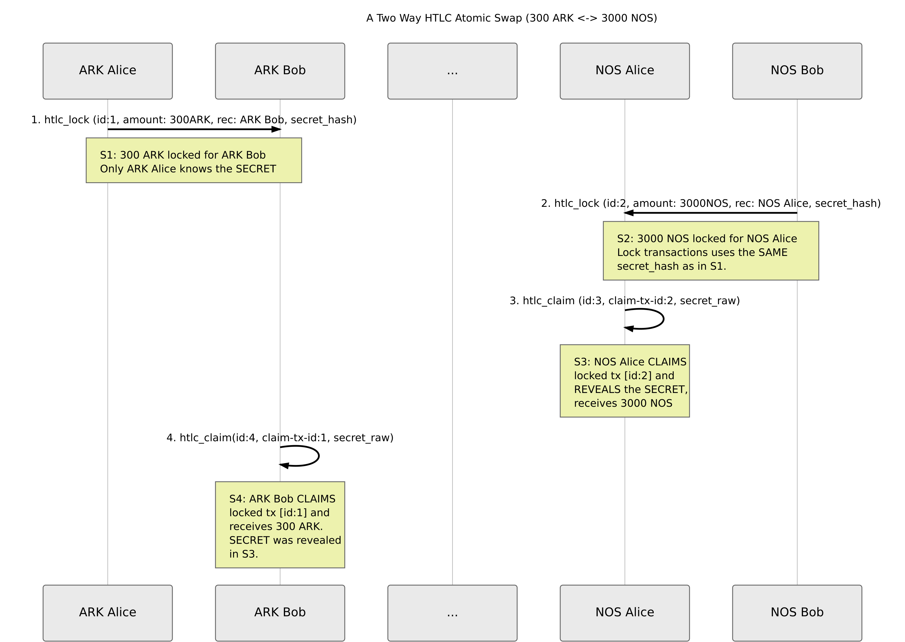

---
  AIP: *102*
  Title: *Hashed Time-Locked Contracts*
  Authors: *ARK.io Team <aips@ark.io>*
  Status: *Draft*
  Discussions-To: https://github.com/arkecosystem/AIPS/issues/102
  Type: *Standards*
  Category: *Core | Network | Protocol*
  Created: *2019-06-27*
  Last Update: *2019-06-27*
  Requires: AIP-11, AIP-28, AIP-29
--- 

# Hashed Time-Locked Contracts

# Introduction

A Hashed Time-Lock Contract (HTLC) is a set of transaction types that permits a designated party (the "sender/seller") to **LOCK** funds by disclosing the preimage (secret) of a hash. It also permits a second party (the "recipient/buyer") to **CLAIM** the funds, or after a timeout is reached enter a **REFUND** situation.

To understand a basic flow of atomic-swap HTLC contracts interacting with each-other check the diagram below, where Chris is swapping 300 ARK for 3000 XQR with Lars. 




Atomic Swap (Source: [Basic Cross-Chain Swap Scenario](https://mermaidjs.github.io/mermaid-live-editor/#/view/eyJjb2RlIjoic2VxdWVuY2VEaWFncmFtXG4gIHRpdGxlOiBBIFR3byBXYXkgSFRMQyBBdG9taWMgU3dhcCAoMzAwIEFSSyA8LT4gMzAwMCBYUVIpXG4gIHBhcnRpY2lwYW50IEExIGFzIEFSSyBDaHJpc1xuICBwYXJ0aWNpcGFudCBBMiBhcyBBUksgTGFyc1xuICBwYXJ0aWNpcGFudCAuLi5cblxuICBBMS0-PkEyOiAxLiBodGxjX2xvY2sgKGlkOjEsIGFtb3VudDogMzAwQVJLLCByZWM6IEFSSyBMYXJzLCBzZWNyZXRfaGFzaClcbiAgTm90ZSBvdmVyIEExLEEyOiBTMTogMzAwIEFSSyBsb2NrZWQgZm9yIEFSSyBMYXJzIDxici8-T25seSBBUksgQ2hyaXMga25vd3MgdGhlIFNFQ1JFVFxuXG4gIHBhcnRpY2lwYW50IFgxIGFzIFhRUiBDaHJpc1xuICBwYXJ0aWNpcGFudCBYMiBhcyBYUVIgTGFyc1xuICBYMi0-PlgxOiAyLiBodGxjX2xvY2sgKGlkOjIsIGFtb3VudDogMzAwMFhRUiwgcmVjOiBYUVIgQ2hyaXMsIHNlY3JldF9oYXNoKVxuICBOb3RlIG92ZXIgWDEsWDI6IFMyOiAzMDAwIFhRUiBsb2NrZWQgZm9yIFhRUiBDaHJpcyA8YnIvPkxvY2sgdHJhbnNhY3Rpb25zIHVzZXMgdGhlIFNBTUUgPGJyLz4gc2VjcmV0X2hhc2ggYXMgaW4gUzEuXG4gIFxuICBYMS0-PlgxOiAzLiBodGxjX2NsYWltIChpZDozLCBjbGFpbS10eC1pZDoyLCBzZWNyZXRfcmF3KVxuICBOb3RlIG92ZXIgWDE6IFMzOiBYUVIgQ2hyaXMgQ0xBSU1TIDxici8-IGxvY2tlZCB0eCBbaWQ6Ml0gYW5kIDxici8-IFJFVkVBTFMgdGhlIFNFQ1JFVCwgPGJyLz4gcmVjZWl2ZXMgMzAwMCBYUVJcbiAgXG4gIEEyIC0-PiBBMjogNC4gaHRsY19jbGFpbShpZDo0LCBjbGFpbS10eC1pZDoxLCBzZWNyZXRfcmF3KVxuICBOb3RlIG92ZXIgQTI6IFM0OiBBUksgTGFycyBDTEFJTVM8YnIvPmxvY2tlZCB0eCBbaWQ6MV0gYW5kIDxici8-IHJlY2VpdmVzIDMwMCBBUksuIDxici8-IFNFQ1JFVCB3YXMgcmV2ZWFsZWQ8YnIvPiBpbiBTMy4iLCJtZXJtYWlkIjp7InRoZW1lIjoibGlnaHQifX0))


## Atomic-Swap Use-Case Scenario

**Step 1**

Chris chooses a [secret password](https://www.random.org/passwords/?num=5&len=8&format=html&rnd=new) (e.g: gtMcn7XGlIbq). He hashes the password using a [one-way hash](https://www.xorbin.com/tools/sha256-hash-calculator) to generate the following **hash**: 

`0f128d401958b1b30ad0d10406f47f9489321017b4614e6cb993fc63913c5454`

Chris sends an ARK blockchain transaction with the instructions, “**Lock 300 ARK from my account for Lars, with the following password hash: **

**0f128d401958b1b30ad0d10406f47f9489321017b4614e6cb993fc63913c5454**

**Step 2**

After waiting for Chris’s transaction to appear on the blockchain, Lars sends a XQR transaction **using the same password hash**, the instruction reads as **“Lock 3000 XQR from my account for Chris, with the following password hash: **

**0f128d401958b1b30ad0d10406f47f9489321017b4614e6cb993fc63913c5454**

**Step 3**

Chris sees that Lars has initiated a transaction, and **claims** his 3000 XQR, using the secret password (gtMcn7XGlIbq) known only to him. Chris claims the XQR with the blockchain transaction: **“Claim 3000 XQR from Lars, the secret password is (gtMcn7XGlIbq) for the password hash:**

**0f128d401958b1b30ad0d10406f47f9489321017b4614e6cb993fc63913c5454**

The password is verified on the XQR blockchain to match the password hash, and the funds are transferred to Chris.

**Step 4**

Lars **sees** the secret password from Chris’s blockchain transaction. He can then make the claim of 300 ARK from Chris by sending a blockchain transaction with the following instructions: **“Claim 300 ARK from Chris, the secret password is (gtMcn7XGlIbq) for the password hash:**

**0f128d401958b1b30ad0d10406f47f9489321017b4614e6cb993fc63913c5454**

The password is verified on the ARK blockchain to match the password hash, and the funds are transferred to Lars. 


## Best practices

In terms of the best practice, the implementation should respect a few rules in order to have a secure atomic swaps:

**Double spend attack mitigation**

The expiration is an indication, but the more the htlc_claim is sent close to the expiration the more room for double spend attack. The double spend attack consists in leverage the different meaning of expiration in different blockchains:


*   Either expiration is relative block height, but due to possible reorganisations, it is impossible to sync the actual expiration date
*   Either expiration is absolute time, but again a reorganisation around the expiration time could make a htlc_claim transaction valid become invalid after the reorganisation.

The best practice is:

*   To set an expiration >> commonly observed reorganisation time (CORT)
*   Chris SHOULD set the htlc_lock expiration > Lars htlc_lock expiration + CORT

# Motivation

HTLC transactions are a safe and cheap method of exchanging secrets for money over the blockchain, due to the ability to recover funds from an uncooperative counterparty and the opportunity that the possessor of a secret has to receive the funds before such a refund can occur. HTLCs also enable cross-chain [atomic swaps.](https://en.bitcoin.it/wiki/Atomic_swap) Although the initial compatibility with Bitcoin and other HTLC script based chains will not be possible out of the box, a new plugin will be developed in order to support this kind of compatibility.

## Prerequisites

**AIP-29, AIP-11, AIP-18. This specification super-seeds the basic timelock specification in AIP-11.**

## General Features

*   All new transaction types SHOULD also support multisig
*   By using the power of vendorField we can add any custom logic, also related to the DEX marketplace
*   Transaction Processing rules are under each section of transaction type
*   Locks are indexed by the wallet manager for faster access (locktx.id => wallet)
*   Fees are addressed in the last section, as well as some remarks updated to transaction types

Check below for specifications of new transaction types. We are introducing the following ones: i.) **htlc_lock**, ii.) **htlc_claim** and  iii.) **htlc_refund**. **htlc_claim** and **htlc_refund** are mutually exclusive, meaning that for referring to the same htlc_lock id, they cannot be added both on the blockchain.


# **1.HTLC_Lock**

A **htlc_lock** transaction will be introduced. The purpose of this transaction is to lock funds of the sender and made them possible for retrieval by the recipient, if he knows the shared secret. 

Name: **htlc_lock | **TypeNumber: **xx**

## **Fields**

> Include base fields from [AIP-11](https://github.com/ArkEcosystem/AIPs/blob/master/AIPS/aip-11.md#general-form-total-header-size-excluding-vendorfield-53-bytes)


<table>
  <tr>
   <td><strong>Field</strong>
   </td>
   <td><strong>Size (bytes)</strong>
   </td>
   <td><strong>Required</strong>
   </td>
  </tr>
  <tr>
   <td><strong>secret_hash</strong> \
<em>A hash of the secret. The SAME hash must be used in the corresponding “claim” transaction.</em>
   </td>
   <td>32
   </td>
   <td>y
   </td>
  </tr>
  <tr>
   <td><strong>recipient</strong>  \
Address
   </td>
   <td>21
   </td>
   <td>Y
   </td>
  </tr>
  <tr>
   <td><strong>expiration</strong> \
<em>Expiration of transaction in <strong>seconds</strong>. </em>
   </td>
   <td>4
   </td>
   <td>Y
   </td>
  </tr>
  <tr>
   <td><strong>amount</strong> \
<em>Amount of network currency that will be locked</em>
   </td>
   <td>8
   </td>
   <td>Y
   </td>
  </tr>
</table>


## **Limitations/Rules**

*   When htlc_lock transaction is applied, the sender’s funds are ~~locked~~ removed (we MUST apply transaction only to sender and DO NOT apply to recipient, this will be done with htlc_claim)
*   The apply logic has to be on the protocol level, as well as on the pool level (tx.blockHeight being replaced by lastBlock.height to account for expiration)
*   Expiration time starts counting when htlc_lock transaction is forged
*   Expiration is defined in seconds. A minimum value should be set to at least one round (think about chain rebuild and possible scenarios; this will be mitigated with tendermint like improvements later on)
*   Set a maximum value on expiration or change dynamic-fee logic to make htlc_locks more expensive, based on number of htlc_lock transaction from sender.
*   Update transaction pool validation logic
*   Update consensus protocol validation logic
*   Add transaction bootstrap for getting this data and update wallets in memory (apply only to sender)


## **Wallets**

In order to implement the HTLC logic in our wallet system, new fields are added:

*   **locks (default empty)** which is a list of htlc_lock transaction ids owned by the wallet
*   **lockedBalance (default 0) **which is the balance of tokens locked

**Important note**: the algorithm to account for voting stake is modified to use lockedBalance, so balance field is modified subtracted.


## **Transaction Processing**

**Verify** 
> All conditions should be true otherwise fails at first fail
*   generic checks (signature, fee, sender, …)

**Apply**
*   w.lockBalance = w.lockBalance + tx.amount
*   w.balance = w.balance - tx.amount - tx.fee
*   w.locks.push(tx)

**Note:** there is no need to verify that tx.recipient exists or to create a wallet if it does not exist

## **Fees**

There is a memory footprint cost for opening a lock on a wallet (storing at least the list of `transactionids` in the wallet, if not the whole transaction for optimisation purpose)

An obvious attack would be to open zillions of 0.00000001 ARK locks.

Possibilities are:

- to limit the number of total open locks at a given time, but would potentially lock out legit people from using htlc
- adjust dynamic htlc_lock fees to total number of open locks

# **2.HTLC_Claim**

A **htlc_claim** Transaction will be introduced. The purpose of this transaction is for the recipient to CLAIM funds from the sender - if he knows the shared secret. 

Name: **htlc_claim | **TypeNumber: **xx**

## **Fields**

> Include base fields from [AIP-11](https://github.com/ArkEcosystem/AIPs/blob/master/AIPS/aip-11.md#general-form-total-header-size-excluding-vendorfield-53-bytes)


<table>
  <tr>
   <td><strong>Field</strong>
   </td>
   <td><strong>Size (bytes)</strong>
   </td>
   <td><strong>Required</strong>
   </td>
  </tr>
  <tr>
   <td><strong>lockTransactionId</strong> \
<em>Htlc_lock transaction id, to serve as a reference</em>
   </td>
   <td>32
   </td>
   <td>Y
   </td>
  </tr>
  <tr>
   <td><strong>unlockSecret</strong> \
<em>In order to issue CLAIM transactions this must be made visible on chain. Its hash must be equal to <strong>htlc_lock.secret_hash</strong>.</em>
   </td>
   <td>32
   </td>
   <td>Y
   </td>
  </tr>
</table>


## **Limitations/Rules**

*   Only a recipient CAN claim the htlc_lock transaction. Meaning htlc_claim senderPublicKey MUST match htlc_lock recipientAddress
*   transactionId of htlc_lock transaction must be forged and accessible inside a block. We should introduce a minimum height/confirmations before we can process this. This goes related to rebuild process and forks (if we can’t replay this during the rebuild process).
*   Fee should be very low, same as transfer / and dynamic


## **Transaction Processing**

**Verify:** 
> All conditions should be true otherwise fails at first fail

*   generic checks on sender (signature, fee, …)
*   find locktx and corresponding wallet (i.e. wallet = walletManager.byLockId(locktx.id))
*   verify sender is recipient of locktx
*   tx.blockHeight < locktx.blockHeight + locktx.expiration
*   locktx.secret_hash = sha256(tx.unlockSecret) // expensive, should be last verification

**Apply:**
*   rw.balance = rw.balance + locktx.amount - tx.fee (tx.fee given to block forger)
*   lw.lockedBalance = w.lockBalance - locktx.amount
*   lw.locks.pop(locktx)


## **Fees**
*   The fees of **htlc_claim** are being applied to the **recipient**. E.g. if sender wallet is empty we cannot apply transaction/the funds are locked. **htlc_claim **fees MUST be applied to receiver (subtracted from claimed amount). 

# **3.HTLC_Refund**

A **htlc_refund** Transaction will be introduced. The purpose of this transaction is for the sender to receive back his locked funds, in the case of recipient not claiming them.

Name: **htlc_refund | **TypeNumber: **xx**


## **Fields**: 
> Include base fields from [AIP-11](https://github.com/ArkEcosystem/AIPs/blob/master/AIPS/aip-11.md#general-form-total-header-size-excluding-vendorfield-53-bytes)

<table>
  <tr>
   <td><strong>Field</strong>
   </td>
   <td><strong>Size (bytes)</strong>
   </td>
   <td><strong>Required</strong>
   </td>
  </tr>
  <tr>
   <td><strong>lockTransactionId</strong> \
<em>Htlc_lock transaction id, to serve as a reference</em>
   </td>
   <td>32
   </td>
   <td>Y
   </td>
  </tr>
</table>


## **Limitations/Rules**
*   Anyone can issue htlc_refund transaction. This makes it easier for businesses and other applications run on top of this to issue automatic refund (controlled by their business logic)
*   In order to refund transaction the expiration of initial transactionID height (htlc_lock) MUST be completed
*   Check if the funds were already claimed. In this case refund MUST NOT be allowed.
*   Fee should be very low, same as transfer / and dynamic
*   The locked balance is still used to compute the stake for voting, hence the amount is no subtracted with the lockedBalance 

## **Transaction Processing**

**Verify:** (all conditions should be true otherwise fails at first fail)

*   generic checks on sender (signature, fee, …)
*   get locker wallet lw from wallet manager, if not found it means it was already claimed or refunded
*   lastBlockHeight > locktx.blockHeight + locktx.expiration

**Apply:**

*   Locker:
    *   locker.lockedBalance -= txw.lockedBalance
    *   locker.locks.remove(lockTx)
*   Sender of refund:
    *   sender.balance -= tx.fee

# Implementation remarks

## **Bootstrap**	

*   To rebuild the htlc locks, we need to review all htlc_lock ids that have not been included into any htlc_claim or htlc_refund. Thus the pseudocode algorithm is (might be optimised):

```
Build walletManager index of active locks { lockTxId => wallet }

count = 0
max = htlc_lock_list - (htlc_claim_list + htlc_refund_list)
for (tx in htlc_lock_list ordered by most recent tx)
  if (count == max)
    exit
  else if htlc_claim_list.pop(lockTransactionId == tx.id)
    continue
  else if htlc_refund_list.pop(lockTransactionId == tx.id)
    continue
  else
    // should exist otherwise raise error
    find wallet w where w.publicKey = tx.senderPublicKey 
    apply tx to w
    count++

```
The algorithm is expected to be O (log(htlc_lock_list.size))

## **Integrity**

Verifying integrity is reviewed using the following rules:

*   #htlc_lock-(#htlc_claim+#htlc_refund) == sum(wallets.locks.size)
*   sum(wallets.lockedBalance + wallets.balance) == supply
*   For all wallets w, w.lockedBalance > 0 || w.locks.size == 0

# **References:**
1. [https://github.com/bitcoin/bips/blob/master/bip-0199.mediawiki](https://github.com/bitcoin/bips/blob/master/bip-0199.mediawiki)
2. [https://github.com/ethereum/EIPs/issues/1631](https://github.com/ethereum/EIPs/issues/1631)
3. [https://rusty.ozlabs.org/?p=462](https://rusty.ozlabs.org/?p=462)
4. [https://www.youtube.com/watch?v=hs79R8kd_70](https://www.youtube.com/watch?v=hs79R8kd_70)
5. [https://dev.lightning.community/resources/index.html](https://dev.lightning.community/resources/index.html)

<!-- Docs to Markdown version 1.0β17 -->
