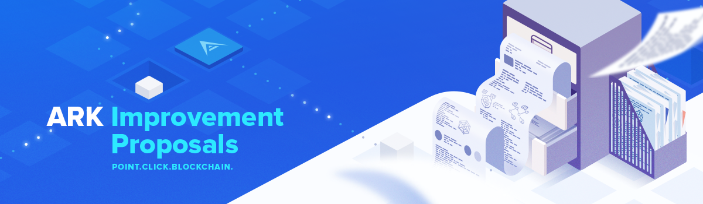

# Contributing
First review *AIP-1 (TODO)*. Then clone the repository and add your AIP to it. There is a *template AIP here (TODO)*. Then submit a Pull Request to Ark's [AIPs repository](https://github.com/ArkEcosystem/AIPs).

# Current AIPs
| Number        | Title        | Author | Type  | Layer        | Status / Discussion |
| ------------- | ------------ | ------ | ----- | ------------ | ------------------- |
| 1 | AIP Purpose and Guidelines | Guillaume Verbal | Meta | | Active |
| [2](AIPS/aip-2.md) | Number of Votes per Account | Guillaume Verbal | Standard | Consensus (hard-fork) | [Canceled](https://github.com/ArkEcosystem/AIPs/issues/1) |
| 3 | Anonymous Vote | Guillaume Verbal | Standard | Consensus (hard-fork) | [Canceled](https://github.com/ArkEcosystem/AIPs/issues/5) |
| 4 | Number of Forging Delegates | Guillaume Verbal | Standard | Consensus (hard-fork) | [Canceled](https://github.com/ArkEcosystem/AIPs/issues/3) |
| 5 | Forging Secret | Guillaume Verbal | Standard | Consensus (hard-fork) | [Canceled](https://github.com/ArkEcosystem/AIPs/issues/6) |
| 6 | Lightning Networks | Guillaume Verbal | Standard | Consensus (hard-fork) | Canceled |
| 7 | Proxy Voting | Guillaume Verbal | Standard | Consensus (hard-fork) | [Canceled](https://github.com/ArkEcosystem/AIPs/issues/2) |
| 8 | An improvement of transaction protocol | Toons | Standard | Network | [Implemented](https://github.com/ArkEcosystem/AIPs/issues/7) |
| 10 | Automatic Profit Sharing | Ryano | Standard | Consensus (hard-fork) | [Canceled](https://github.com/ArkEcosystem/AIPs/blob/master/AIPS/aip-10.md) |
| 11 | Upgrade of Transaction Protocol | FX Thoorens, Dafty | Standard | Consensus (hard-fork) | [Implemented](https://github.com/ArkEcosystem/AIPs/blob/master/AIPS/aip-11.md) |
| 12 | Smart Contract | FX Thoorens, Adrian Cearnau | Standard | Consensus (hard-fork) | [Draft](https://github.com/ArkEcosystem/AIPs/blob/master/AIPS/aip-12.md) |
| 13 | URI Scheme | William Dens | Standard  | Applications | [Draft](/AIPS/aip-13.md) |
| 14 | RESTful API | Brian Faust | Standard  | Applications | [Implemented](/AIPS/aip-14.md) |
| 15 | Event based subscriptions (WebHooks) | Kristjan Kosic | Standard  | Applications | [Implemented](/AIPS/aip-15.md) |
| 16 | Dynamic fee calculations | Kristjan Kosic, FX Thoorens, Alex Barnsley | Standard  | Protocol | [Implemented](/AIPS/aip-16.md) |
| 17 | Transaction pool wallet manager | Kristjan Kosic, FX Thoorens | Standard  | Protocol | [Implemented](/AIPS/aip-17.md) |
| 18 | Multisignature protocol | FX Thoorens, Alex Barnsley | Standard  | Protocol | [In progress](/AIPS/aip-18.md) |
| 19 | Incremental snapshot system | FX Thoorens, Kristjan Kosic | Standard  | Core | [Implemented](/AIPS/aip-19.md) |
| 20 | Arkchain network registration for bip44 derivation path  | FX Thoorens | Standard  | Core | [Draft](https://github.com/ArkEcosystem/AIPs/issues/29) |
| 21 | Ark Masternodes | galperins4 | Standard  | Core / Protocol | [Open Discussion](/AIPS/aip-21.md) |
| 22 | On chain price discovery using liquidity gates | mak | Standard  | Core / Protocol | [Open Discussion](/AIPS/aip-22.md) |
| 23 | Delegate markets and Ark token economic rework | mak | Standard  | Core / Protocol | [Open Discussion](/AIPS/aip-23.md) |
| 24 | Double forging protocol improvements | Kristjan Kosic | Standard  | Core / Protocol | [Open Discussion](/AIPS/aip-24.md) |
| 25 | Providing PoW like guarantees on (D)PoS networks | mak | Standard  | Core / Protocol | [Open Discussion](/AIPS/aip-25.md) |
| 26 | URI Scheme Improvements | vmunich | Standard  | Core / Protocol | [Open Discussion](/AIPS/aip-26.md) |
